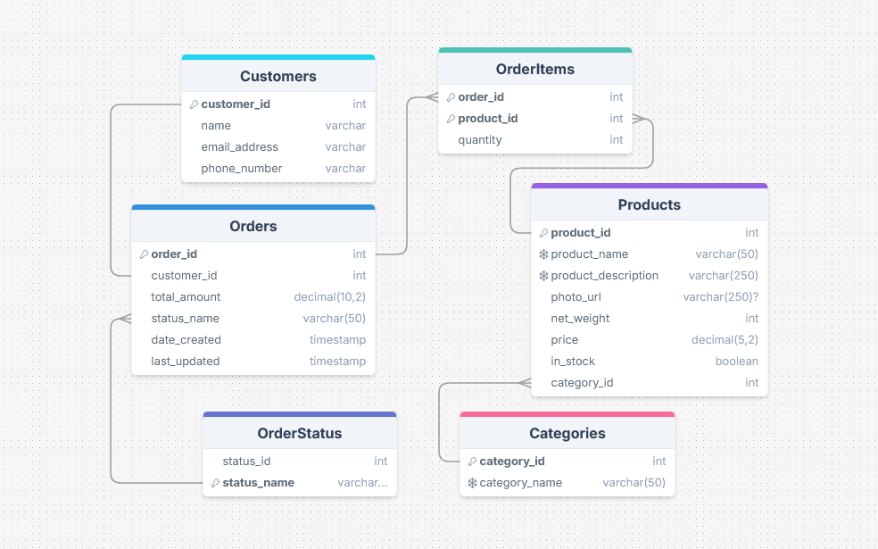

# Frambô Confeitaria Backend Study

This is the main application for this study project: a Spring Boot MVC web app for a cookie store e-commerce system. It's the follow-up to [this project](https://github.com/mattoi/fcc-spring-boot-tutorial) where I coded along a FreeCodeCamp tutorial. This MVC app provides a database integration and endpoints to access it. The database is set to be containerized for easy setup. You can perform various CRUD operations to manipulate customer, product and order data. I implemented the operations I thought would be useful in a real-life scenario.

This project features a PostgreSQL database and a repository layer using JDBC. The controllers provide endpoints for managing customers, products and orders. Each request is passed down to the service layer for data validation, checking for errors that the user can correct on their next request. If the request is valid, then it's passed to the repository. I tried to provide coherent status codes and error messages based on good experiences I've had using previous third-party APIs.

For learning purposes, I tried to do as much manual work as possible so I understand how things work without relying on too many abstractions. This includes using JDBC over JPA or CrudRepository, and manually writing the API docs instead of using SpringDoc.

There are also unit tests for the service layer and integration tests for the controller layer. I wrote one test of each type for each possible response code, i.e successfully update customer (204)/ failed to find customer to update (404) / invalid fields for updating (422). All the tests are working properly.

As for the remaining tasks, there are only small readability and refactoring things, so I can do these later. The core features of the application should be working exactly as I wanted them to.

### TODO
- Make sure the unit and integration tests are working.
- Use the logger where applicable.
- Consider implementing better null checking across the project.
- Implement authentication.
- Settle on using either order status id or order status name.
- Some minor fixes marked TODO in the class files.

## How To Run This Application

Requirements:
- Windows, Linux or Mac OS
- Java 17 
- Docker Desktop (for the PostgreSQL container)

Setup:
1. Clone the project repository
2. Make sure Docker Desktop is running
3. Go to the `./spring-boot/` folder
4. (Optional) To start the database container independently from the application, run `docker compose up`. Otherwise it will be started automatically with the Spring application, and stopped when it closes.
5. Run `./gradlew bootRun` to start the application. If you want to use the provided example database rows (recommended for first launch), run `./gradlew bootRun --run-initial-data'` instead. This will restore the tables to the example values if they have been modified as well.

The database schema is set to be executed on startup. After launching the app, you can try out the endpoints with a HTTP client like Postman. The provided [request collection](src\main\resources\Frambo.postman_collection.json) can be imported to Postman for an easy setup.

## API Documentation

Here you can find descriptions for each type of JSON object representing an entity in the application and the endpoints for their manipulation. Fields with a * can't be null, but depending on the HTTP method, some of them can be omitted. I did implement some Delete methods, but realized that the relational structure will rarely allow any deletions, so I chose to disable them.


### Customer

Represents a store customer, with a name, contact information and an ID that's tied into any orders they create.

| Field        | Type        | Description                                    |
| ------------ | ----------- | ---------------------------------------------- |
| id*          | int         | Unique identifier.                             |
| name*        | string(250) | Customer's name.                               |
| emailAddress | string(250) | Customer's email address. Unique.              |
| phoneNumber* | string(20)  | Customer's phone number. Only numbers. Unique. |

#### [POST] New customer
`/api/customers`

Adds a new customer to the database. The ID is generated automatically.

##### Request body format
```
{
    name* (String(250))
    email (String(250))
    phoneNumber* (String(20))
}
```
##### Responses
```
201 Created

id (int)
```

```
422 Unprocessable Entity

[
    "Name cannot be empty",
    "Phone number needs to have at least 7 characters"
]
```

#### [PATCH] Update customer
`/api/customers?id={id}`

Updates a costumer's name or contact fields. The provided `id` specifies the customer that will be modified. 

##### Request body format
```
{
    name (String(250))
    email (String(250))
    phoneNumber (String(20))
}
```
##### Responses
```
204 No content
```

```
404 Not Found

"Couldn't find a customer with ID 44"
```

```
422 Unprocessable Entity

[
    "New phone number needs to have at least 7 characters"
]
```

#### [GET] All customers
`/api/customers`

Returns a list with all registered customers.

##### Responses
```
200 OK

[
    {
        id (int)
        name (String(250))
        email (String(250))
        phoneNumber (String(20))
    }, ...
]
```

#### [GET] Find customer by ID
`/api/customers?id={id}`

Returns the customer associated with the `id` parameter.

##### Responses
```
200 OK

{
    id (int)
    name (String(250))
    email (String(250))
    phoneNumber (String(20))
}
```

```
404 Not Found

"Couldn't find a customer with ID 44"
```

### Product

Represents a product that can be ordered by a customer.

| Field        | Type          | Description                                        |
| ------------ | ------------- | -------------------------------------------------- |
| id*          | int           | Unique identifier.                                 |
| name*        | string(50)    | Product name. Unique.                              |
| description* | string(250)   | Product description. Unique.                       |
| netWeight*   | int           | Product net weight.                                |
| price*       | decimal(5, 2) | Product price. Has to be bigger than 0.            |
| inStock*     | boolean       | Whether or not it's available for ordering.        |
| categoryId*  | int           | Refers to an existing row in the categories table. |

The **category** table works as an enum, only there to ensure the product belongs to an existing category.

| Field | Type       | Description            |
| ----- | ---------- | ---------------------- |
| id*   | int        | Unique identifier.     |
| name* | string(50) | Category name. Unique. |

#### [POST] New product
`/api/products`

Adds a new product to the database. The ID is generated automatically. The `category` needs to refer to the name of an existing category.

##### Request body format
```
{
    name* (String(50))
    description* (String(250))
    photoUrl (String(250))
    netWeight* (int)
    price* (double)
    inStock* (boolean)
    category* (String(50))
}
```
##### Responses
```
201 Created

id (int)
```

```
422 Unprocessable Entity

[
    "Product name cannot be empty",
    "Product description cannot exceed 250 characters",
    "Product price must be greater than zero"
]
```
#### [PATCH] Update product
`/api/products?id={id}`

Updates a product's fields. The provided `id` specifies the product that will be modified. 

##### Request body format
```
{
    name (String(50))
    description (String(250))
    photoUrl (String(250))
    netWeight (int)
    price (double)
    inStock (boolean)
    category (String(50))
}
```
##### Responses
```
204 No Content
```

```
404 Not Found

"Couldn't find a product with ID 35"
```

```
422 Unprocessable Entity

[
    "Product name cannot be empty",
    "Product net weight must be greater than zero"
]
```

#### [GET] All products
`/api/products`

Returns a list with all registered products.

##### Responses
```
200 OK

[
    {
        id (int)
        name (String(50))
        description (String(250))
        photoUrl (String(250))
        netWeight (int)
        price (double)
        inStock (bool)
        category (String(50))
    }, ...
]
```

#### [GET] Find product by ID
`/api/products?id={id}`

Returns the product with the specified ID.

##### Responses
```
200 OK

{
    id (int)
    name (String(50))
    description (String(250))
    photoUrl (String(250))
    netWeight (int)
    price (double)
    inStock (bool)
    category (String(50))
}
```

```
404 Not Found

"Couldn't find a product with ID 35"
```

#### [GET] Find products in stock
`/api/products/in_stock`

Returns a list of all products where `inStock` equals `true`.

##### Responses
```
200 OK

[
    {
        id (int)
        name (String(50))
        description (String(250))
        photoUrl (String(250))
        netWeight (int)
        price (double)
        inStock (bool)
        category (String(50))
    }, ...
]
```

#### [POST] New category
`/api/products/categories`
Adds a new category to the database. The ID is generated automatically. 

##### Request body format
```
{
    name* (String(50))
}
```
##### Responses
```
201 Created

id (int)
```

```
422 Unprocessable Entity

[
    "A category with the same name already exists"
]
```

#### [PATCH] Update category
`/api/products/categories?id={id}`

Updates a category's name. The provided `id` specifies the category that will be modified.

##### Request body format
```
{
    name* (String(50))
}
```
##### Responses
```
204 No Content
```

```
404 Not Found

"Couldn't find a category with ID 27"
```

```
422 Unprocessable Entity

[
    "New category name cannot be empty"
]
```

#### [GET] All categories
`/api/products/categories`

Returns a list of all categories.

##### Responses
```
200 OK

[
    {
        id (int)
        name (String(50))
    }, ...
]
```

### Order

Represents an order, always assigned to a customer and containing one or more items.

| Field        | Type          | Description                                    |
| ------------ | ------------- | ---------------------------------------------- |
| id*          | int           | Unique identifier.                             |
| customerId*  | int           | Refers to the customer that made the order.    |
| totalAmount* | double        | The order's final price.                       |
| statusName*  | string(50)    | Refers to an existing row in the status table. |
| dateCreated* | LocalDateTime | Moment when the order was created.             |
| lastUpdated* | LocalDateTime | Moment when the status was last updated.       |

Each order's items is stored as a row in a separate table of **order items**.

| Field      | Type | Description                           |
| ---------- | ---- | ------------------------------------- |
| orderId*   | int  | The order it's assigned to.           |
| productId* | int  | The product that was ordered.         |
| quantity*  | int  | How many of the product were ordered. |

The **status** table serves as an enum, currently with only 4 values: `PAYMENT_PENDING`, `SHIPPED`, `DELIVERED` and `CANCELED`.

 | Field | Type       | Description            |
 | ----- | ---------- | ---------------------- |
 | id*   | int        | Unique identifier.     |
 | name* | string(50) | Category name. Unique. |

#### [POST] New order
`/api/orders`

Adds a new order to the database. The ID is generated automatically. The `customerId` must match an existing customer ID, and each item's `productId` must match an existing product ID.

##### Request body format
```
{
    customerId (int)
    totalAmount (double)
    items [
        {
            productId (int)
            productName (String(50))
            productPrice (double)
            quantity (int)
        }
    ], ...
}
```
##### Responses
```
201 Created

id (int)
```

```
422 Unprocessable Entity

[
    "Total amount must be higher than zero",
    "Item 1: Product ID can't be empty",
    "Item 3: Quantity must be higher than zero",
    "Couldn't find a customer with ID 70"
]
```

#### [PATCH] Update order status
`/api/orders?id={id}`

Updates an order's status and its last_updated time. 

##### Request body format
```
{
    status* (String(50))
}
```
##### Responses
```
204 No Content
```

```
404 Not Found

"Couldn't find an order with ID 53"
```

```
422 Unprocessable Entity

[
    "Invalid status"
]
```

#### [GET] All orders
`/api/orders`

Returns a list with all registered orders.

##### Responses
```
200 OK

[
    {
        id (int)
        customerId (int)
        items [
            {
                productId (int)
                productName (String(50))
                productPrice (double)
                quantity (int)
            }, ...
        ]
        status (String(50))
        dateCreated (LocalDateTime)
        lastUpdated (LocalDateTime)
    }, ...
]
```

#### [GET] Find by ID
`/api/orders?id={id}`

Returns the order associated with the provided ID.

##### Responses
```
200 OK

{
    id (int)
    customerId (int)
    items [
        {
            productId (int)
            productName (String(50))
            productPrice (double)
            quantity (int)
        }, ...
    ]
    status (String(50))
    dateCreated (LocalDateTime)
    lastUpdated (LocalDateTime)
}
```

```
404 Not Found

"Couldn't find an order with ID 28"
```

#### [GET] Find all by customer ID
`/api/orders?customer_id={id}`

Returns a list of all orders associated with the provided customer ID.

##### Responses
```
200 OK

{
    id (int)
    customerId (int)
    items [
        {
            productId (int)
            productName (String(50))
            productPrice (double)
            quantity (int)
        }, ...
    ]
    status (String(50))
    dateCreated (LocalDateTime)
    lastUpdated (LocalDateTime)
}
```

#### [GET] Find all by status
`/api/orders?status={status}`

Returns a list of all orders marked with the provided status name.

##### Responses
```
200 OK

{
    id (int)
    customerId (int)
    items [
        {
            productId (int)
            productName (String(50))
            productPrice (double)
            quantity (int)
        }, ...
    ]
    status (String(50))
    dateCreated (LocalDateTime)
    lastUpdated (LocalDateTime)
}
```

## Project structure
This project features a package-by-feature structure. This means that each entity and all of the classes directly involving it are in the same folder. This made more sense to me, as imports are naturally handed in each package. Details on each layer of the application are descibed below.

### Database
The application uses a PostgreSQL database that's containerized using Spring Boot's Docker integration. The [schema](spring-boot\src\main\resources\schema.sql) and some [initial data](spring-boot\src\main\resources\initial_data.sql) for easy testing of the HTTP calls are provided in the resources folder. I tried to add as many constraints as I thought would be in line with a cookie store's business logic, such as not allowing zero-item orders or multiple products with the same name or description. These rules are also checked in the Service layer when possible, to prevent unnecessary database calls. 

The following is a diagram representation of the database's schema.



### Model Layer
Each entity is mostly a 1-to-1 representation of its database, except for the order items, which compose a list inside the pertaining order. I chose to use records for the classes, as there shouldn't be any attribute editing involved anywhere in the application's workflow. 

I am considering, however, using Null checking and consequently implementing a "Request" class for each model, as the nullable fields would need to be different between them. If I was using a more modern language I would probably have to do that, but since Java has such an "opt-in" implementation of null checking, I guess the current method works for now.

### Repository Layer
The repository classes use `jdbcClient` to interact with the database by using direct SQL queries and operations. I found out about JPA while implementing this layer, and I see how it can be useful for faster prototyping and less error-prone queries, but I wanted to practice my SQL so I went with JDBC instead. Also, apparently JPA can run about 4x slower than JDBC? I didn't test it, but writing pure SQL didn't hurt. 

### Service Layer
The `@Service` layer is meant to validade requests coming in from the controllers to make sure the request bodies are in line with the business logic. In case of an invalid request, the methods in this layer will attempt to point out all the errors that need fixing in order to turn it into a valid one.

### Controller Layer
This layer uses `@RestController` to offer HTTP endpoints for the various database operations implemented in the project. By default, `@ModelAttribute` uses Jackson to automatically convert the data classes into JSON and vice-versa, but in some methods it was preferrable to use `@RequestBody` with a `Map` to get more specific results. Each method returns an appropriate response code for each type of input, and show the errors found in the Service layer when applicable.